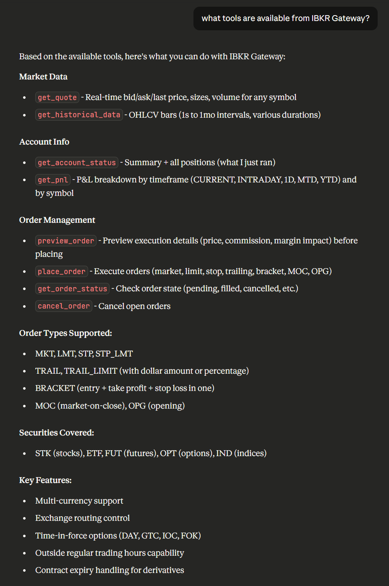

# IBKR Gateway

A complete, modular integration of Interactive Brokers (IBKR) with multiple interfaces: direct Python, REST API, and Claude MCP integration.

Querying Claude for Available Tools


## ⚠️ SAFETY FIRST ⚠️

This system is **SAFE BY DEFAULT**:

✅ **Paper trading mode**: System defaults to paper trading (`TRADING_MODE=paper`)
✅ **Orders disabled**: Order placement is disabled by default (`ORDERS_ENABLED=false`)
✅ **Dual-toggle protection**: Live trading requires BOTH flags AND confirmation file
✅ **Preview before place**: MCP tools require explicit confirmation for all orders

### Default Behavior

- **Market data**: ✅ Available (read-only)
- **Account status**: ✅ Available (read-only)
- **Order preview**: ✅ Available (simulation)
- **Order placement**: ❌ Disabled (returns SIMULATED status)

### How to Enable Live Trading (⚠️ USE WITH EXTREME CAUTION)

We **strongly recommend** staying in paper mode. If you must enable live trading:

1. Set `TRADING_MODE=live` in `.env`
2. Set `ORDERS_ENABLED=true` in `.env`
3. Create confirmation file: `touch ~/ibkr_live_trading_confirmed.txt`
4. Set `LIVE_TRADING_OVERRIDE_FILE=~/ibkr_live_trading_confirmed.txt` in `.env`

**WARNING**: Once enabled, the system can place REAL orders with REAL money.

### Testing Live Trading Setup

Test with SMALL orders first. Use limit orders FAR from market price to avoid fills.
Monitor your IBKR account portal during testing.

---

## Quick Demo (5 Minutes)

Want to see the system in action? Run our interactive demo to explore market data and account features.

### Prerequisites

- IBKR account with paper trading enabled
- IBKR Gateway or TWS running in paper mode (port 4002)
- Market data subscriptions (paper accounts have free delayed data)

### Run the Demo

```bash
# 1. Copy environment file
cp .env.example .env

# 2. Ensure TRADING_MODE=paper in .env (default)

# 3. Install dependencies
poetry install

# 4. Run the demo
python -m ibkr_core.demo
# or
ibkr-demo
```

### What the Demo Shows

The demo showcases three core capabilities:

1. **Market Data**
   - Real-time quote for AAPL (stock)
   - Historical bars for SPY (ETF) - last 5 days

2. **Account Status**
   - Account summary (balance, buying power, P&L)
   - Current positions (if any)

### Docker Demo

You can also run the demo in Docker:

```bash
docker-compose -f docker-compose.demo.yml up
```

**Note**: The Docker container connects to IBKR Gateway running on your host machine via `host.docker.internal`.

### Troubleshooting

| Issue | Solution |
|-------|----------|
| "IBKR Gateway not detected" | Ensure TWS/Gateway is running on port 4002 |
| "Demo requires TRADING_MODE=paper" | Set `TRADING_MODE=paper` in your `.env` file |
| "Market data permission error" | Paper accounts have free delayed data; check IBKR subscriptions |
| Connection timeout | Verify IBKR Gateway API settings are enabled (Configure → API → Settings) |

### Expected Output

The demo displays:
- ✓ Connection status with server time
- ✓ AAPL quote with bid/ask/last prices
- ✓ SPY historical bars (last 5 entries)
- ✓ Account summary with buying power
- ✓ Current positions (if any)
- ✓ Next steps and documentation links

---

## Command-Line Interface

The `ibkr-gateway` command provides a user-friendly CLI for common operations.

### Available Commands

```bash
ibkr-gateway --help              # Show all commands
ibkr-gateway healthcheck         # Check IBKR Gateway connection
ibkr-gateway demo                # Run interactive demo
ibkr-gateway start-api           # Start REST API server
ibkr-gateway version             # Show version info
```

### Health Check

Check the connection to IBKR Gateway:

```bash
# Basic health check
ibkr-gateway healthcheck

# Check with paper mode (force)
ibkr-gateway --paper healthcheck

# Check with custom host/port
ibkr-gateway --host localhost --port 4002 healthcheck
```

**Output**: Connection status, server time, managed accounts

### Demo Mode

Run the interactive 5-minute demo:

```bash
# Run demo (paper mode required)
ibkr-gateway demo

# Demo with explicit paper mode
ibkr-gateway --paper demo
```

The demo automatically runs in paper mode for safety, even if you specify `--live`.

### Start API Server

Launch the FastAPI REST server:

```bash
# Start with defaults (port 8000)
ibkr-gateway start-api

# Custom port
ibkr-gateway start-api --port 8080

# Development mode with auto-reload
ibkr-gateway start-api --reload

# Custom host binding
ibkr-gateway start-api --host 0.0.0.0 --port 8000
```

**Endpoints available at**:
- API Documentation: http://localhost:8000/docs
- Health Check: http://localhost:8000/health
- OpenAPI Schema: http://localhost:8000/openapi.json

### Global Options

Apply to any command:

- `--host <host>`: Override IBKR Gateway host
- `--port <port>`: Override IBKR Gateway port
- `--paper`: Force paper trading mode
- `--live`: Force live trading mode (⚠️ **DANGEROUS**)
- `--help`: Show help for any command

### Examples

```bash
# Check paper trading connection
ibkr-gateway --paper healthcheck

# Run demo in paper mode
ibkr-gateway demo

# Start API server on custom port with auto-reload
ibkr-gateway start-api --port 8080 --reload

# Force live mode connection check (⚠️ use with caution)
ibkr-gateway --live healthcheck
```

---

## Project Status

| Phase | Description | Status |
| ------- | ------------- | -------- |
| Phase 0 | Repo structure, environment, safety rails | ✅ Complete |
| Phase 1 | IBKR client wrapper, contract resolution | ✅ Complete |
| Phase 2 | Market data (quotes, historical bars) | ✅ Complete |
| Phase 3 | Account status, positions, P&L | ✅ Complete |
| Phase 4 | Order placement and management | ✅ Complete |
| Phase 5 | FastAPI REST layer | ✅ Complete |
| Phase 6 | MCP server for Claude integration | ✅ Complete |
| Phase 7 | Natural language agent layer | Planned |
| Phase 8 | Monitoring, simulation, persistence | Planned |

## Three Ways to Use

### 1. Direct Python (Manual Use)

Use the `ibkr_core` module directly in Python scripts or notebooks:

```python
from ibkr_core.client import IBKRClient
from ibkr_core.models import SymbolSpec
from ibkr_core.market_data import get_quote, get_historical_bars
from ibkr_core.account import get_account_summary, get_positions
from ibkr_core.orders import place_order, preview_order

# Connect to IBKR Gateway
client = IBKRClient(mode="paper")
client.connect()

# Get a quote
spec = SymbolSpec(symbol="AAPL", securityType="STK", exchange="SMART", currency="USD")
quote = get_quote(spec, client)
print(f"AAPL: ${quote.last} (bid: {quote.bid}, ask: {quote.ask})")

# Get account info
summary = get_account_summary(client)
print(f"Net Liquidation: ${summary.netLiquidation:,.2f}")

client.disconnect()
```

### 2. REST API

Run the FastAPI server for HTTP access:

```bash
# Start the API server
python -m api.server

# Or with uvicorn directly
uvicorn api.server:app --host 0.0.0.0 --port 8000
```

**API Endpoints:**

| Method | Endpoint | Description |
| -------- | --------- | ------------- |
| GET | `/health` | Health check and connection status |
| POST | `/market-data/quote` | Get market quote |
| POST | `/market-data/historical` | Get historical bars |
| GET | `/account/summary` | Get account summary |
| GET | `/account/positions` | Get positions |
| GET | `/account/pnl` | Get P&L |
| POST | `/orders/preview` | Preview order |
| POST | `/orders` | Place order |
| GET | `/orders/{id}/status` | Get order status |
| POST | `/orders/{id}/cancel` | Cancel order |

**Example API calls:**

```bash
# Get a quote
curl -X POST http://localhost:8000/market-data/quote \
  -H "Content-Type: application/json" \
  -d '{"symbol": "AAPL", "securityType": "STK"}'

# Get account summary
curl http://localhost:8000/account/summary

# Preview an order
curl -X POST http://localhost:8000/orders/preview \
  -H "Content-Type: application/json" \
  -d '{
    "instrument": {"symbol": "AAPL", "securityType": "STK"},
    "side": "BUY",
    "quantity": 10,
    "orderType": "LMT",
    "limitPrice": 150.00
  }'
```

### 3. Claude MCP Integration

Use with Claude Desktop or any MCP-compatible client for natural language interaction with your brokerage.

**Setup:**

1. Start the REST API server (must be running):

   ```bash
   python -m api.server
   ```

2. Add to Claude Desktop config (`claude_desktop_config.json`):

   ```json
   {
     "mcpServers": {
       "ibkr-gateway": {
         "command": "python",
         "args": ["-m", "mcp_server.main"],
         "cwd": "C:\\path\\to\\mm-ibkr-gateway",
         "env": {
           "IBKR_API_URL": "http://localhost:8000"
         }
       }
     }
   }
   ```

3. Restart Claude Desktop

**Available MCP Tools:**

| Tool | Description |
| ------ | ------------- |
| `get_quote` | Get real-time bid/ask/last price, sizes, volume |
| `get_historical_data` | Get OHLCV bars (1m to 1mo intervals) |
| `get_account_status` | Get summary + all positions |
| `get_pnl` | Get P&L breakdown by timeframe and symbol |
| `preview_order` | Preview execution details before placing |
| `place_order` | Execute orders (market, limit, stop, trailing, bracket) |
| `get_order_status` | Check order status (pending, filled, cancelled) |
| `cancel_order` | Cancel open orders |

**Supported Order Types:**

- MKT, LMT, STP, STP_LMT
- TRAIL, TRAIL_LIMIT (with dollar amount or percentage)
- BRACKET (entry + take profit + stop loss)
- MOC (market-on-close), OPG (opening)

**Securities Covered:**

- STK (stocks), ETF, FUT (futures), OPT (options), IND (indices)

---

## Quick Start

### Prerequisites

- Python 3.10+
- Running IBKR Gateway or TWS (Paper account recommended)
- Poetry or pip for dependency management

### Installation

```bash
# Clone and enter directory
cd mm-ibkr-gateway

# Install dependencies
poetry install
# or
pip install -e .
```

### Configuration

1. Copy the example environment file:

   ```bash
   cp .env.example .env
   ```

2. Edit `.env` for your setup:

   ```ini
   # IBKR Gateway Connection
   IBKR_GATEWAY_HOST=127.0.0.1
   PAPER_GATEWAY_PORT=4002
   PAPER_CLIENT_ID=1
   LIVE_GATEWAY_PORT=4001
   LIVE_CLIENT_ID=777

   # Safety Settings
   TRADING_MODE=paper          # paper or live
   ORDERS_ENABLED=false        # set to true to enable real orders

   # API Settings (optional)
   API_KEY=                    # set to require X-API-Key header
   API_PORT=8000
   ```

3. Verify connection:

   ```bash
   python -m ibkr_core.healthcheck
   ```

---

## Architecture

```text
┌─────────────────┐     ┌─────────────────┐     ┌─────────────────┐
│  Claude Desktop │     │   Your Code     │     │   curl / HTTP   │
│   (MCP Client)  │     │   (Python)      │     │   Client        │
└────────┬────────┘     └────────┬────────┘     └────────┬────────┘
         │                       │                       │
         │ stdio                 │ import                │ HTTP
         ▼                       ▼                       ▼
┌─────────────────┐     ┌─────────────────────────────────────────┐
│   MCP Server    │───> │              REST API (FastAPI)         │
│   (Phase 6)     │HTTP │              (Phase 5)                  │
└─────────────────┘     └────────────────────┬────────────────────┘
                                             │
                                             │ function calls
                                             ▼
                        ┌─────────────────────────────────────────┐
                        │            ibkr_core                    │
                        │  ┌──────────┐ ┌──────────┐ ┌──────────┐ │
                        │  │ market   │ │ account  │ │ orders   │ │
                        │  │ _data.py │ │ .py      │ │ .py      │ │
                        │  └──────────┘ └──────────┘ └──────────┘ │
                        │  ┌──────────┐ ┌──────────┐ ┌──────────┐ │
                        │  │ client   │ │contracts │ │ models   │ │
                        │  │ .py      │ │ .py      │ │ .py      │ │
                        │  └──────────┘ └──────────┘ └──────────┘ │
                        └────────────────────┬────────────────────┘
                                             │
                                             │ ib_insync
                                             ▼
                        ┌─────────────────────────────────────────┐
                        │         IBKR Gateway / TWS              │
                        │         (Paper or Live)                 │
                        └─────────────────────────────────────────┘
```

---

## Project Structure

```text
mm-ibkr-gateway/
├── ibkr_core/              # Core IBKR integration (Phases 0-4)
│   ├── client.py           # Connection wrapper
│   ├── config.py           # Environment & safety config
│   ├── contracts.py        # Contract resolution
│   ├── market_data.py      # Quotes & historical data
│   ├── account.py          # Account status & positions
│   ├── orders.py           # Order placement
│   └── models.py           # Pydantic models
│
├── api/                    # FastAPI REST layer (Phase 5)
│   ├── server.py           # Endpoint definitions
│   ├── models.py           # HTTP request/response models
│   ├── auth.py             # API key authentication
│   ├── dependencies.py     # FastAPI dependencies
│   └── errors.py           # Error handling
│
├── mcp_server/             # MCP server (Phase 6)
│   ├── main.py             # 8 MCP tools
│   ├── config.py           # MCP configuration
│   ├── http_client.py      # Async HTTP client
│   └── errors.py           # Error translation
│
├── tests/                  # 100+ tests
│   ├── test_mcp_tools.py   # MCP tool tests
│   ├── test_mcp_errors.py  # Error handling tests
│   ├── test_api_*.py       # API endpoint tests
│   └── test_*.py           # Core module tests
│
├── .context/               # Design documentation
│   ├── PHASE_PLAN.md       # Implementation roadmap
│   ├── SCHEMAS.md          # JSON Schema definitions
│   ├── ARCH_NOTES.md       # Architecture decisions
│   └── TODO_BACKLOG.md     # Task tracking
│
└── .env.example            # Configuration template
```

---

## Running Tests

```bash
# Run all tests
pytest

# Run with verbose output
pytest -v

# Run specific test files
pytest tests/test_mcp_tools.py tests/test_mcp_errors.py -v

# Run with coverage
pytest --cov=ibkr_core --cov=api --cov=mcp_server

# Skip integration tests (no IBKR Gateway needed)
pytest -m "not integration"
```

---

## Environment Variables

| Variable | Default | Description |
| ---------- | --------- | ------------- |
| `IBKR_GATEWAY_HOST` | `127.0.0.1` | IBKR Gateway hostname |
| `PAPER_GATEWAY_PORT` | `4002` | Paper trading port |
| `PAPER_CLIENT_ID` | `1` | Paper trading client ID |
| `LIVE_GATEWAY_PORT` | `4001` | Live trading port |
| `LIVE_CLIENT_ID` | `777` | Live trading client ID |
| `TRADING_MODE` | `paper` | `paper` or `live` |
| `ORDERS_ENABLED` | `false` | Enable order placement |
| `API_KEY` | (none) | API key for REST authentication |
| `API_PORT` | `8000` | FastAPI server port |
| `IBKR_API_URL` | `http://localhost:8000` | REST API URL (for MCP server) |
| `MCP_REQUEST_TIMEOUT` | `60` | MCP request timeout in seconds |

---

## Key Design Decisions

1. **Schema-Driven**: All data models match `.context/SCHEMAS.md` exactly
2. **Pydantic Models**: Strong typing with IDE support and runtime validation
3. **Thin MCP Layer**: MCP tools are thin HTTP wrappers around the REST API
4. **Dedicated IBKR Thread**: Single-threaded executor for ib_insync event loop safety
5. **Error Preservation**: Error codes flow from IBKR → Core → API → MCP consistently

---

## Documentation

- [Phase Plan](.context/PHASE_PLAN.md) - Implementation roadmap
- [Schemas](.context/SCHEMAS.md) - JSON Schema definitions (source of truth)
- [Architecture Notes](.context/ARCH_NOTES.md) - Design decisions
- [TODO Backlog](.context/TODO_BACKLOG.md) - Task tracking and technical debt
- [API Documentation](api/API.md) - REST API reference
